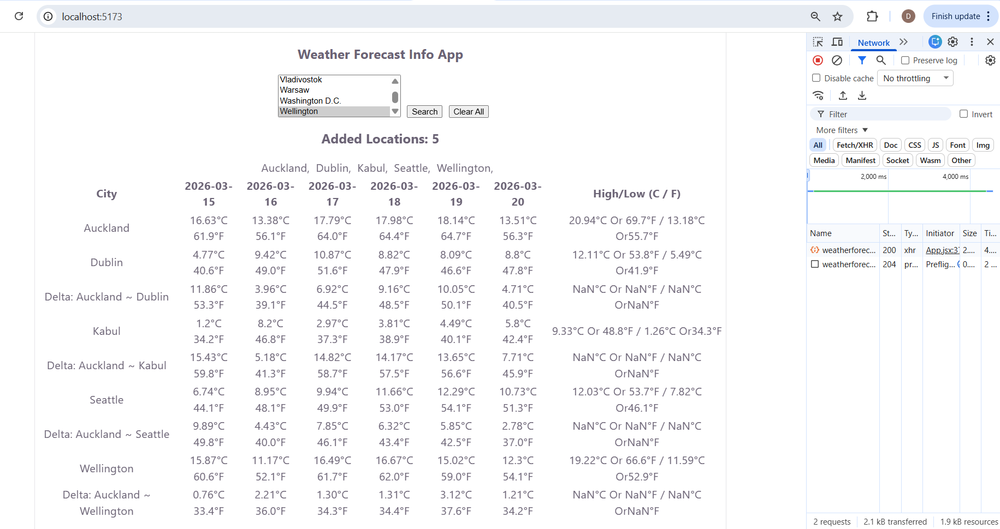

Weather Forecast App

This is a simple weather forecast app built using React and DotNet. It allows users to search for the future weather and forecast some of the listed cities in the world. 
(Note: For time being, I were provided City list as static array in Ui Local file.)

Provided a Multi select option to select multiple cities more than 2 cities.
(Note: For time being, Used only select Option, instead of Search Option. )

As Instructed, Utilized Tommorrow.io API for obtaining weather forecast details for Cities.

Degree Celcius to Farenheit Conversion were done in Ui.

Utlizing Post method written in dotNet.

Here, I had added a screenshot by Selecting 5 Cities with Delta comparison with First City by achieving strech goal.

